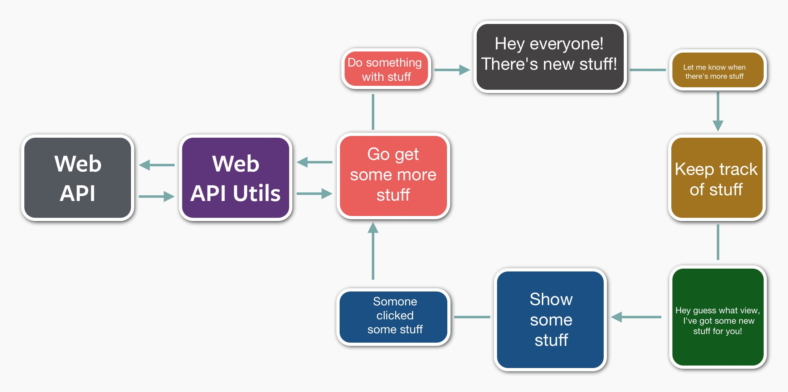

# React

[@rimthong](https://twitter.com/rimthong) & [@BenjaminDreux](https://twitter.com/BenjaminDreux)

---

# Qu'est-ce que React?

* Techno de Facebook.
* On l'appelle le V de MVC, mais pas exact.
* Ça ressemble un peu aux Web Components.

---

# React est... étrange

  * Controverse sur les bonnes pratiques (onClick)
  * HTML dans le Javascript (JSX)

---

# React est... rapide

  * Utilisation de virtual DOM

---

# Ben et Alex ont testé!

  * Créé une application bugtracker
  (TODO: petit dessin de la séparation des composantes)

---

# Vue d'un issue

````javascript
var Issue = React.createClass({
  render: function() {
    return (
      <div className="issue">
        <div>Title: {this.props.issue.title}</div>
        <div>Status: {this.props.issue.status}</div>
        <div>Reporter: {this.props.issue.reporter}</div>
        <div>Description: {this.props.issue.description}</div>
      </div>
    );
  }
});
````

---

# Liste des issues

````javascript
var IssueList  = React.createClass({
  getInitialState: function() { return {issues: IssueStore.getIssues()}; },
  componentDidMount: function(){ IssueStore.addChangeListener(this.onChange); },
  componentDidUnmount: function(){ IssueStore.removeChangeListener(this.onChange); },
  onChange: function(){ this.setState({issues: IssueStore.getIssues()}); },
  render: function(){
    var elements = this.state.issues.map(function(issue){
      return <li key={issue.id}> <Issue issue={issue}/> </li>
    });
    return <ul> {elements} </ul>
  }
});
````

Note: `elm.key` -> faciliter le diff/update pour react

---


C'est tout pour React

# bonne journée

---


... presque


---

# Comment on branche le tout?

* Gros trip de Dev
* render _gratuit_
* permet le pattern flux

---

# What the Flux??


---

# Dispatcher

```` javascript
var Dispatcher = require("flux").Dispatcher;
var IssueDispatcher = _.extend( new Dispatcher(), {});
````

---

# Reaction du Store
    
````javascript
IssueDispatcher.register(function(action){
  switch(action.type){
    case 'issue:add':
      IssueStore.addIssue(action.payload)
    break;
    case 'issue:fetch':
      IssueStore.set(action.payload)
    break;
  }
});
````

---

# Store

````javascript
var CHANGE_EVENT = 'changed';
var IssueStore = _.extend({}, EventEmitter.prototype, {
  issues: [], 
  emitChange: function() {this.emit(CHANGE_EVENT);},
  addChangeListener: function(callback){this.on(CHANGE_EVENT, callback);},
  removeChangeListener: function(callback){this.removeListener(CHANGE_EVENT, callback); },
  getIssues: function(){return this.issues},
  addIssue:function(issue){
    this.issues.push(issue);
    this.emitChange();
  },
  set:function(newIssues){
    this.issues = newIssues;
    this.emitChange();
  }
});
````


---

# Composantes

````javascript
var NewIssueForm = React.createClass({
  addIssue:function(e){
    var issue = {title: this.refs.title.getDOMNode().value};
    IssueActionCreator.createNewIssue(issue);
    e.stopPropagation(); e.preventDefault();
  },
  render: function() {
    return (
      <form className="new-issue-form" onSubmit={this.addIssue}>
        <div className="form-group">
          <label > Title: </label>
          <input className="form-control" ref="title" />
        </div>
        <button>Add</button>
    </form>
    );
}});
````

Note: `@ref="title"` -> `this.refs.title.getDOMNode()`


---

# Action creator

```` javascript
var IssueActionCreator = {
  createNewIssue:function(issue){
    //Appel au backend
    IssueDispatcher.dispatch({
      type:"issue:add",
      payload: issue
    });
  },
  fetchIssues:function(){
    // Appel au backend
    var issues = [{id:1, title:"Changer la couleur des bouton"},
                  {id:2, title:"J'aime pas la couleur du bouton"}]; 
    
    IssueDispatcher.dispatch({
      type:'issue:fetch',
      payload: issues
    });
  }
};
````

---

# Interface client API

    // INSERT YOUR CODE HERE

---

# Flux, C'est juste ça !!




---

# Test

Jest

* Jasmine ++ (it.only, xit, pit, xdescribe)
* Auto mocking
* Output de comparaison json _A la elixir_
* Pas un requis pour tester du REACT
* Implementation de dom

    
React.addon.TestUtils

* Rendu de composant
* Simulation d'evenement utilisateur (key, click...)
* Mock de composant


---

# Exemple de test

``` jsx
jest.dontMock('../js/NewIssueForm');

it.only(trigger an action on click, function(){

  React = require('react/addons');
  TestUtils = React.addons.TestUtils;

  var form = TestUtils.renderIntoDocument(<NewIssueForm/>);
  var button = TestUtils.findRenderedDOMComponentWithTag(form, 'button');

  TestUtils.Simulate.submit(button)

  expect(IssueActionCreator.createNewIssue.mock.calls.length).toBe(1)
});

```

---

# Browserify

* Module _A la node_ dans le frontend aujourd'hui
* Pipline de transformation de code (jsx, coffee, minify, uglify...)
* package.json: 

````javascript    
  "scripts": {
    "start": "watchify -o bundle.js -v -d js/*",
    "test": "jest",
    "build": "NODE_ENV=production browserify . | uglifyjs -cm > bundle.min.js"
  },
  "browserify": {
    "transform": [
      "envify",
      "reactify"
    ]
  },

````

---

# Alternatives

* Raynos/mercury (Uber) -> immutablilité par défaut
* Riot.js (Muut, disqus like) -> Diff simpliste
* Mithril -> Angular avec Virtual DOM
* Ractive -> Backbone avec Virtual DOM
* OM ou Quiescent (Interface Clojure script pour React )
* ELM (language appart)

Note: 
Riot diff simpliste

Mercury & Mirthill semble 4 à 5 fois plus rapide que React

Ractive semble 2 fois plus lent que React

---

# React Vs. Web components

Les techno de base ne sont pas supporté nativement aujourd'hui, voir:

* http://caniuse.com/#search=object.observe
* http://caniuse.com/#search=shadowdom
* http://caniuse.com/#search=import
* http://caniuse.com/#search=template (moins vrai)

Sauf pour chrome

---

# Des questions?
