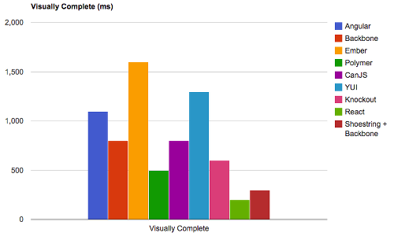
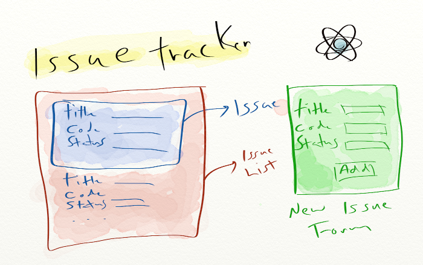
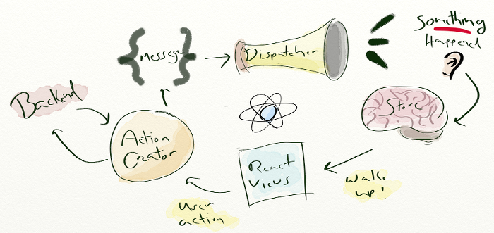

# React

[@rimthong](https://twitter.com/rimthong) & [@BenjaminDreux](https://twitter.com/BenjaminDreux)

Note: Alex

---

# Qu'est-ce que React?

* Techno de Facebook
* V de MVC
* Similaire aux Web Components

Note: Facebook l'utilise dans ses projets en prod: Messagerie, Instagram entièrement en react. React fait juste du visuel, il se fout un peu du reste de l'appli, donc on peut l'introduire petit à petit dans des apps. Par exemple, la messagerie facebook. React encourage la déconstruction d'app en plusieurs composantes réutilisables qui peuvent être assemblées. La gestion des styles n'est pas aussi naturelle que dans le cas du Shadow DOM.

---

# React fait réagir

  

  * Controverse sur les bonnes pratiques
  * Mix de présentation + code

Note: Facebook s'est amusé à redéfinir les bonnes pratiques. OnClick, OnSubmit, directement dans les tags HTML et les composantes sont programmées en JSX, qui est du Javascript, mais qui peut aussi contenir du HTML. 

---

# React est... rapide

  

  * DOM Virtuel
  * Binding unidirectionel

Note: Modifs au virtual dom, diff des composantes, render du real dom. Permet aussi l'isomorphisme (pas dans la présentation.) Le DOM virtuel est composé d'éléments beaucoup plus simples, sérialisable (non circulaires).

---

# Faisons une app!



Note: Voici l'app décomposée en composantes.

---

# Vue d'un issue

````javascript
var Issue = React.createClass({
  render: function() {
    return (
      <div>
        <div>Title: {this.props.issue.title}</div>
        <div>Status: {this.props.issue.status}</div>
        <div>Reporter: {this.props.issue.reporter}</div>
        <div>Description: {this.props.issue.description}</div>
      </div>
    );
  }
});
````

---

# Liste des issues

````javascript
var IssueList  = React.createClass({
  getInitialState: function() { return {issues: [{id:1, ...}]}; },
  render: function(){
    var elements = this.state.issues.map(function(issue){
      return <li key={issue.id}> <Issue issue={issue}/> </li>
    });
    return <ul> {elements} </ul>
  }
});
````

Note: `elememt key` -> faciliter le diff/update pour react

---

# Formulaire

````javascript
var NewIssueForm = React.createClass({
  addIssue:function(e){
    var issue = {title: this.refs.title.getDOMNode().value};
    ...
  },
  render: function() {
    return 
      <form className="new-issue-form" onSubmit={this.addIssue}>
        <div className="form-group">
          <label > Title: </label>
          <input className="form-control" ref="title" />
        </div>
        ...
        <button>Add</button>
    </form>
  }
});
````

---

C'est tout pour React

# bonne journée

---


... presque


Note: Alex

---

# React
* Gros trip de Dev
* render _gratuit_
* permet le pattern flux

------

# Flux
* Comment on branche le tout?


---

# What the Flux??


---

# Dispatcher

```` javascript
var Dispatcher = require("flux").Dispatcher;
var IssueDispatcher = _.extend(new Dispatcher(), {});
````

---

# Reaction du Store
    
````javascript
IssueDispatcher.register(function(action){
  switch(action.type){
    case 'issue:add':
      IssueStore.addIssue(action.payload);
    break;
    case 'issue:fetch':
      IssueStore.set(action.payload);
    break;
  }
});
````

---

# Store

````javascript
var CHANGE_EVENT = 'changed';
var IssueStore = _.extend({}, EventEmitter.prototype, {
  issues: [], 
  emitChange: function() {this.emit(CHANGE_EVENT);},
  addChangeListener: function(callback){this.on(CHANGE_EVENT, callback);},
  removeChangeListener: function(callback){this.removeListener(CHANGE_EVENT, callback); },
  getIssues: function(){return this.issues},
  addIssue:function(issue){
    this.issues.push(issue);
    this.emitChange();
  },
  set:function(newIssues){
    this.issues = newIssues;
    this.emitChange();
  }
});
````


---

# Composantes

````javascript
var NewIssueForm = React.createClass({
  addIssue:function(e){
    var issue = {title: this.refs.title.getDOMNode().value};
    IssueActionCreator.createNewIssue(issue);
    e.stopPropagation(); e.preventDefault();
  },
  render: function() {
    return (
      <form className="new-issue-form" onSubmit={this.addIssue}>
        <div className="form-group">
          <label > Title: </label>
          <input className="form-control" ref="title" />
        </div>
        <button>Add</button>
    </form>
    );
}});
````

Note: `@ref="title"` -> `this.refs.title.getDOMNode()`


---

# Action creator

```` javascript
var IssueActionCreator = {
  createNewIssue:function(issue){
    //Appel au backend
    IssueDispatcher.dispatch({
      type:"issue:add",
      payload: issue
    });
  },
  fetchIssues:function(){
    // Appel au backend
    var issues = [{id:1, title:"Changer la couleur des bouton"},
                  {id:2, title:"J'aime pas la couleur du bouton"}]; 
    
    IssueDispatcher.dispatch({
      type:'issue:fetch',
      payload: issues
    });
  }
};
````

---

# Interface client API

    // INSERT YOUR CODE HERE

---

# Flux pour les nuls




---

# Test

Jest

* Jasmine ++ (it.only, xit, pit, xdescribe)
* Auto mocking
* Output de comparaison json _A la elixir_
* Pas un requis pour tester du REACT
* Implementation de dom

    
React.addon.TestUtils

* Rendu de composant
* Simulation d'evenement utilisateur (key, click...)
* Mock de composant

 Note: Ben
 

---

# Exemple de test

``` jsx
jest.dontMock('../js/NewIssueForm');

it.only(trigger an action on click, function(){

  React = require('react/addons');
  TestUtils = React.addons.TestUtils;

  var form = TestUtils.renderIntoDocument(<NewIssueForm/>);
  var button = TestUtils.findRenderedDOMComponentWithTag(form, 'button');

  TestUtils.Simulate.submit(button)

  expect(IssueActionCreator.createNewIssue.mock.calls.length).toBe(1)
});

```

---

# Browserify

* Module _A la node_ dans le frontend _aujourd'hui_
* Pipline de transformation de code (jsx, coffee, minify, uglify...)
* package.json: 

````javascript    
  "scripts": {
    "start": "watchify -o bundle.js -v -d js/*",
    "test": "jest",
    "build": "NODE_ENV=production browserify . | uglifyjs -cm > bundle.min.js"
  },
  "browserify": {
    "transform": [
      "envify",
      "reactify"
    ]
  },

````

---

# Alternatives

* Raynos/mercury (Uber) -> immutablilité par défaut
* Riot.js (Muut, disqus like) -> Diff simpliste
* Mithril -> Angular avec Virtual DOM
* Ractive -> Backbone avec Virtual DOM
* OM ou Quiescent (Interface Clojure script pour React )
* ELM (language appart)

Note: 
Riot diff simpliste

Mercury & Mirthill semble 4 à 5 fois plus rapide que React

Ractive semble 2 fois plus lent que React

---

# React Vs. Web components

Les techno de base ne sont pas supporté nativement aujourd'hui, voir:

* http://caniuse.com/#search=object.observe
* http://caniuse.com/#search=shadowdom
* http://caniuse.com/#search=import
* http://caniuse.com/#search=template (moins vrai)

Sauf pour chrome

---

# Des questions?
